# employeeTracker

## Description

This project demonstrates a command line input (CLI) application utilizing mySQL database and queries.   The Employee Tracker application contains database tables for department, role and employees.   The user is able to create, read, update and delete (CRUD) from the employee tracker database.   The application permits the user via the CLI to view the data in either the department, role or employee table.  The application further allows the user to add data into the department, role and employee tables.  Update functionality permits the user to update an employee's role.

An extensive menu system is displayed to the user grouped by CRUD functionality in order to keep the menu interface clean and intuitive.   This means all the add/create options are under one menu, all the view options are under another menu option and so on.

For bonus features, the application incorporated updating an employee's manager, viewing employees by manager, viewing the total budget of a department.   In addition, viewing all employee information from all 3 tables in one result set and allowing user to delete a department, role or employee was added to the application.  The delete functionality for department and role took into account whether there were related data in the other tables that also needed to be deleted.  For example, if there was an employee with a role associated to a department, when that department was deleted then the application deletes corresponding data from the other tables also.  The same methodology was applied if user was deleting a role.  The application checks if there are employees currently with that role and also deletes those employees.

SQL SELECT queries were utilized everywhere that was possible to display lists of possible selections to the user instead of having the user manually enter an ID or other data that could be mistyped.   This made the application more robust such that the user only had to make selections from lists rather than typing everything in at the command line.

Most of the result sets returned from the SQL queries were manipulated to display department name, role or manager name information instead of just integer ID fields that mean nothing to the end user.  The only place the raw ID information is displayed to the end user is where the user selects to just view the department, role or employee table.

## Table of Contents

* [Screenshots](#Screenshots)
* [Installation](#Installation)
* [Usage](#Usage)
* [Support](#Support)
* [Technologies](#Technologies)
* [Video](#Video)
* [Repository](#Repository)
* [Output](#Output)

## Screenshots

Screen shots are grouped by View, Add, Update and Delete functions.   See Screenshot Table of Contents below:

* [View](#View)
* [Add](#Add)
* [Update](#Update)
* [Delete](#Delete)

The following is a screenshot of the Employee Tracker application Main menu.

  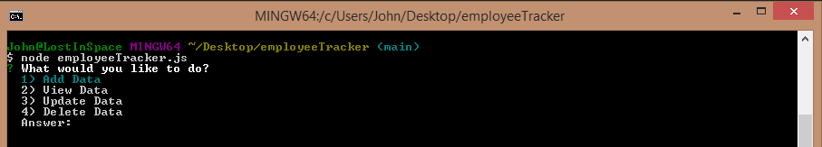

## View

The following is a screenshot of the Employee Tracker application View menu.

  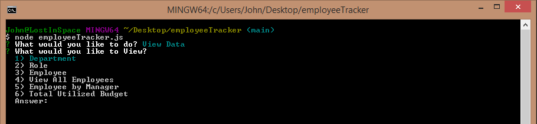

The following is a screenshot of the Employee Tracker application View Department results.

  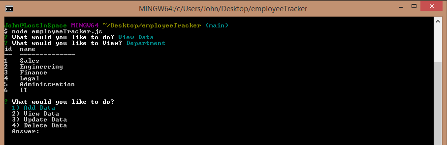

The following is a screenshot of the Employee Tracker application View Role results.

  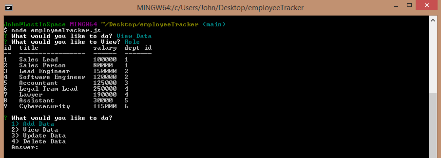

The following is a screenshot of the Employee Tracker application View Employee results.

  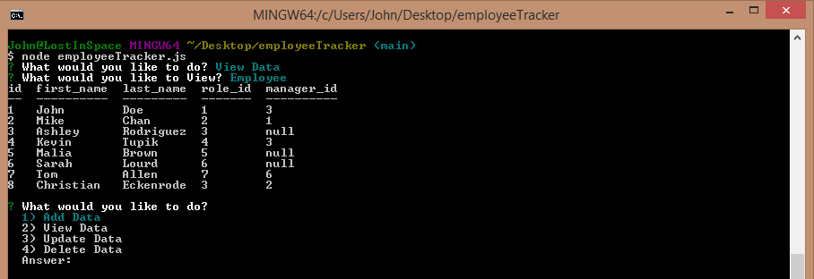

The following is a screenshot of the Employee Tracker application View Employee by Manager results.

  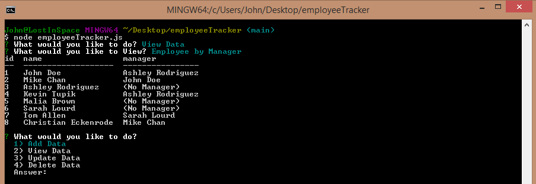

The following is a screenshot of the Employee Tracker application View All Employees results.

  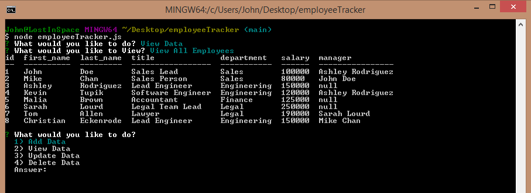

The following is a screenshot of the Employee Tracker application View Total Budget results.

  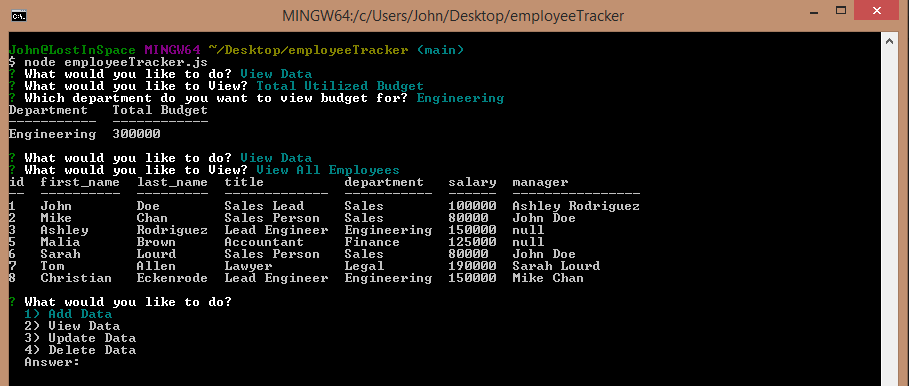

## Add

The following is a screenshot of the Employee Tracker application Add Menu.

  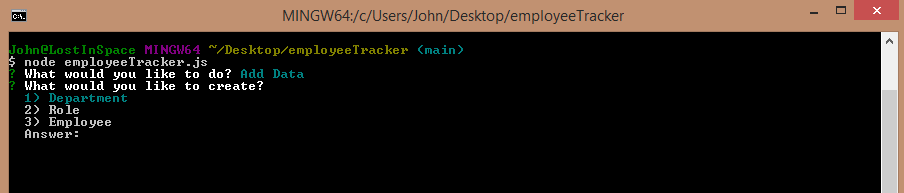

The following is a screenshot of the Employee Tracker application Add Department option.

  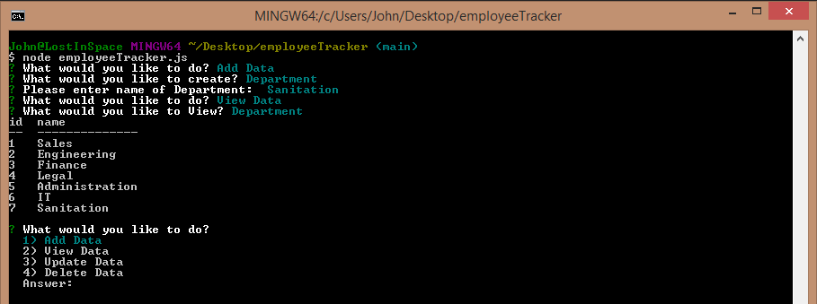

The following is a screenshot of the Employee Tracker application Add Role option.

  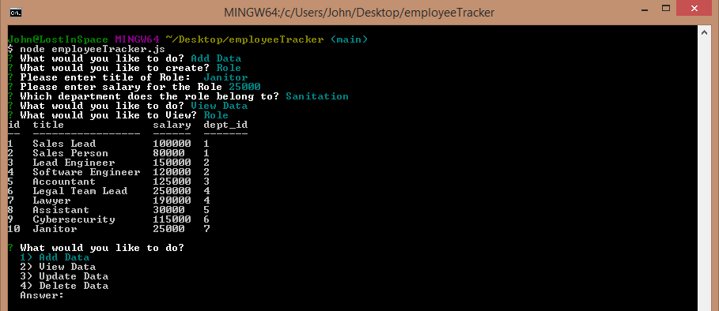

The following is a screenshot of the Employee Tracker application Add Employee option.

  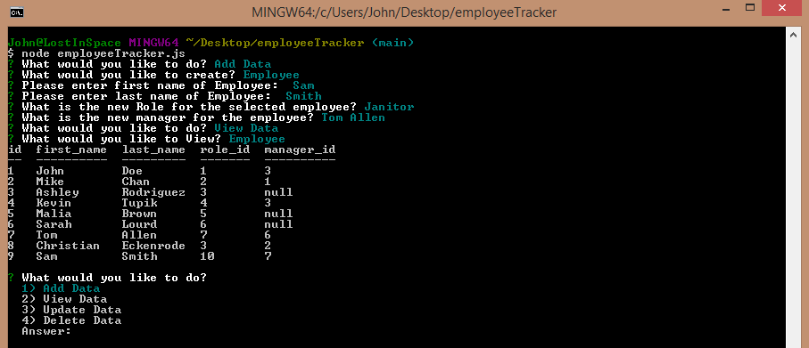

## Update

The following is a screenshot of the Employee Tracker application Update menu.

  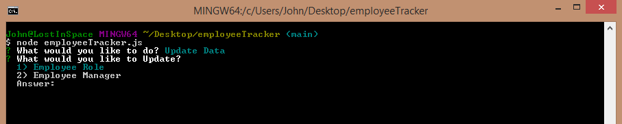

The following is a screenshot of the Employee Tracker application Update Employee Role option.

  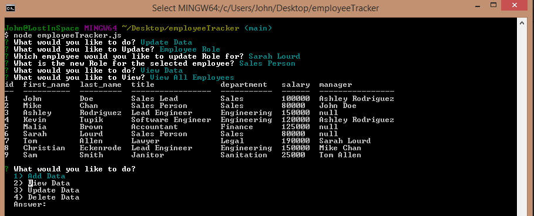

The following is a screenshot of the Employee Tracker application Update Employee Manager option.

  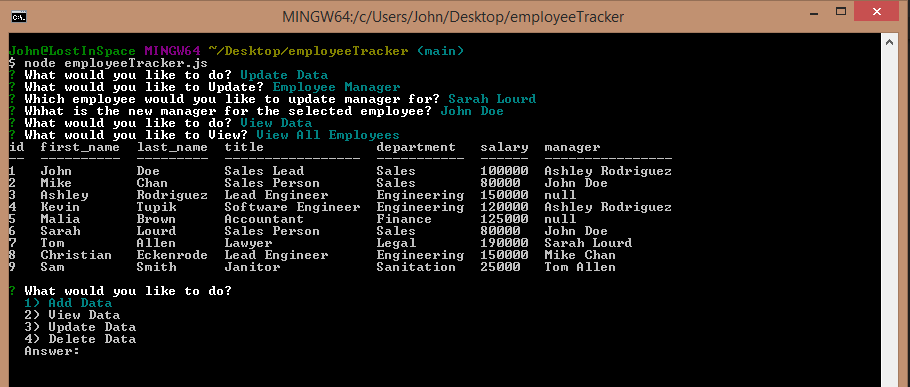

## Delete

The following is a screenshot of the Employee Tracker application Delete menu.

  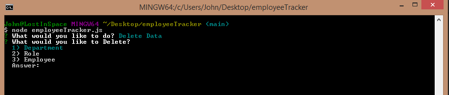

The following is a screenshot of the Employee Tracker application Delete Department option.

  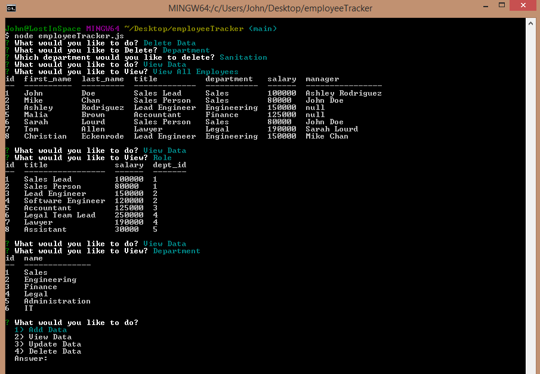

The following is a screenshot of the Employee Tracker application Delete Role option.

  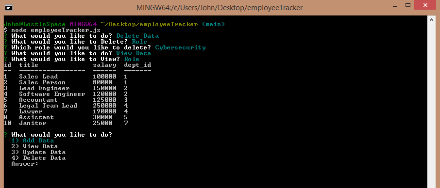

The following is a screenshot of the Employee Tracker application Delete Employee option.

  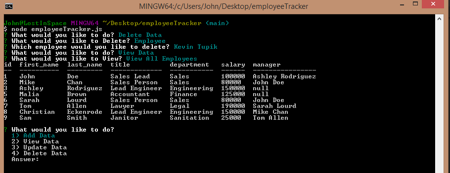

## Installation

* Install node.js to computer, if not already present.
    * Node.js can be installed from [here](https://nodejs.org/en/)
* Copy all the application files locally to one's machine.
* In a terminal window where you copied the files, install 'inquirer' and 'mysql' using node package manager (npm)
    * **npm install**

## Usage

This application requires Node.js to be installed.  It also requires the user to have installed 'Inquirer' and 'mySQL' via npm.  (See [Installation](#installation) section.)  Once these items have been installed, the user can launch the application from a terminal window as follows:

**node employeeTracker.js**

## Support

Please email me for further information jtoth7824@gmail.com

## Technologies

Node.js

mySQL

Javascript

npm

inquirer

## Video

Due to there being no front end to this project that a user can open in a browser, please view the following video links to get a feel for how the application is executed and types of options available to user to interact with the database tables.

Due to limit on Screencastify of 5 minutes, I have recorded 4 short videos - one for each operation of CRUD.

### view data
https://drive.google.com/file/d/1fvK3-NwZH7Yf-UvJcNltxiG798uKDm-X/view?usp=sharing

### add data
https://drive.google.com/file/d/19jsz2wY62gkj-VScgdu75wjM9lYWugZ0/view?usp=sharing

### update data
https://drive.google.com/file/d/1otkA8BqcynAB6hv6da0zDpVSgkBvi9OV/view?usp=sharing

### delete data
https://drive.google.com/file/d/1w8cZnOBAC1JEZGAyNsebuMjJdY4SZIvo/view?usp=sharing

## Repository

Direct link to repository:  https://github.com/jtoth7824/employeeTracker